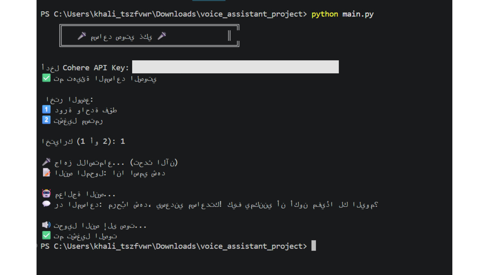

# 🎤 Voice-to-Voice AI Assistant
An intelligent assistant that converts natural speech into AI understanding and an audio response.

---

## 📋 The Three Basic Steps
* **Step 1 (Speech-to-Text):** 🎤 User's voice → Converted to text (Google STT)
* **Step 2 (LLM Processing):** 🤖 Processed using LLM (Cohere API)
* **Step 3 (Text-to-Speech):** 🔊 Converted back to audio and played to the user

---

## 📸 Demo & Execution Result
Here is how the project looks and runs in action:

> **Terminal Output Screenshot:**  
> 

**Terminal Text Output Example:**
```text

    ║   🎤 مساعد صوتي ذكي 🎤      ║
   
    
أدخل Cohere API Key:

✅ تم تهيئة المساعد الصوتي

 اختر الوضع:
1️⃣  دورة واحدة فقط
2️⃣  تشغيل مستمر

اختيارك (1 أو 2): 1

🎤 جاهز للاستماع... (تحدث الآن)
📝 النص المحول: انا اسمي شهد

🤖 معالجة النص...
💬 رد المساعد: مرحبًا شهد، يسعدني مساعدتك! كيف يمكنني أن أكون مفيدًا لك اليوم؟

🔊 تحويل النص إلى صوت...
✅ تم تشغيل الصوت

#🔧 Requirements and Installation
1️⃣ Install Required Libraries
Run the following command to install dependencies:
